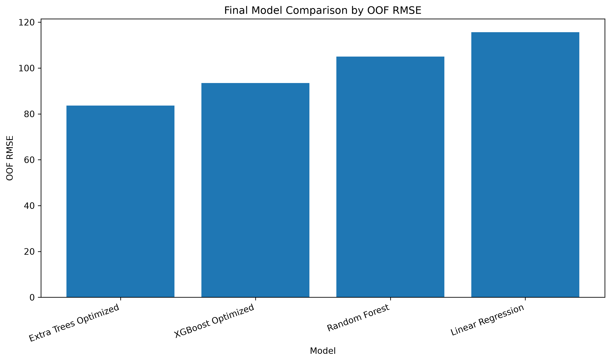
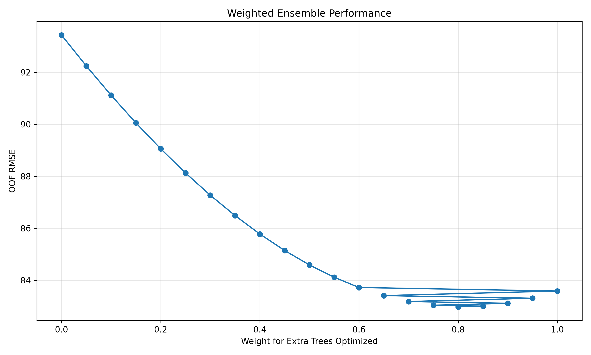
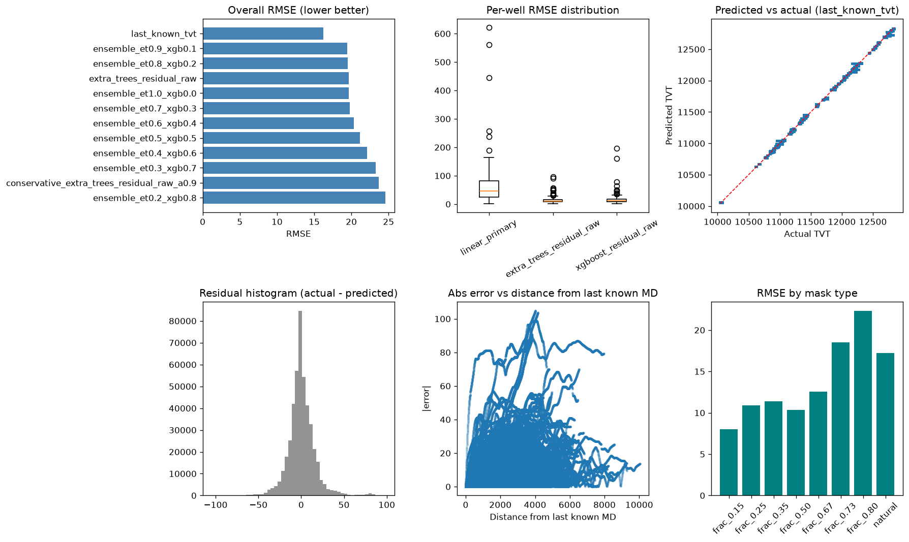
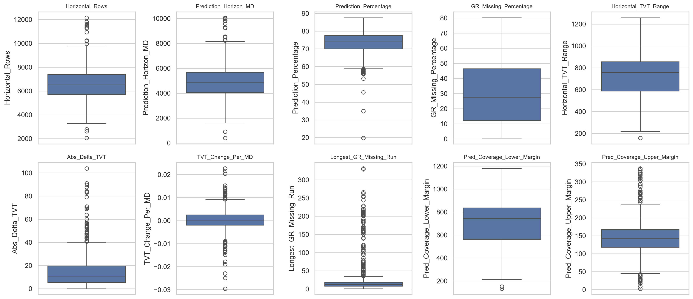

# Full Model Evaluation and Implementation Details

The wellbore TVT (True Vertical Thickness) prediction model was rigorously tested and evaluated using multiple performance metrics and validation protocols. The goal was to select the most accurate, leakage-safe model for real-world trailing-mask TVT predictions on horizontal wells.

---

## 1. Model Evaluation

### 1.1. Model Evaluation Metrics

The following evaluation metrics were used to assess the model’s effectiveness:

- **Root Mean Squared Error (RMSE):** Measures how much the predicted TVT deviates from the actual TVT. Lower values indicate better performance. This was the primary selection metric.
- **Mean Absolute Error (MAE):** Captures the average absolute differences between predictions and actual values, and is less sensitive to extreme outliers than RMSE.
- **Well-level statistics:** Mean / median / max well RMSE, fold standard deviation (stability), and win counts across wells were tracked to avoid selecting a model that only wins on aggregate error.

> **Note:** R² was not used as a primary metric for this project. TVT prediction under a trailing-mask protocol is better judged by absolute depth error (RMSE / MAE) than by variance explained.

Validation evolved in three stages:

1. **Baselines** — simple geological carry-forward and extrapolation rules
2. **Absolute-TVT ML** — GroupKFold by `well_id` (5 folds, 773 wells)
3. **Production residual + blend** — trailing-mask holdout validation matching competition scoring

---

### 1.2. Model Performance Summary

#### Stage A — Non-ML baselines (773 wells)

| Model | Mean RMSE ↓ | Mean MAE ↓ | Win % ↑ |
|---|---:|---:|---:|
| **Last Known TVT** | **12.81** | **10.93** | **77.5%** |
| Linear Extrapolation (10) | 58.14 | 49.36 | 8.0% |
| Linear Extrapolation (100) | 60.19 | 51.28 | 7.6% |
| Z → TVT Linear | 110.88 | 99.62 | 0.4% |
| Formation Marker | 1017.93 | 903.66 | 0.0% |

**Observation:** Last Known TVT is an extremely strong baseline. Any ML approach must beat (or at least carefully improve upon) carry-forward of the last observed `TVT_input`.

#### Stage B — Absolute-TVT classic ML (5-Fold GroupKFold)

| Model | OOF RMSE ↓ | OOF MAE ↓ |
|---|---:|---:|
| **Extra Trees Optimized** | **83.59** | **37.75** |
| XGBoost Optimized | 93.43 | 46.28 |
| Random Forest | 105.00 | 48.51 |
| Linear Regression | 115.64 | 83.84 |
| Weighted Ensemble (ET 0.80 + XGB 0.20) | **82.98** | **38.10** |



*Figure 1 — Absolute-TVT GroupKFold bake-off. Extra Trees Optimized achieved the lowest individual OOF RMSE (~83.6).*



*Figure 2 — Ensemble weight search (Extra Trees vs XGBoost). Optimal weight ≈ 0.80 Extra Trees → OOF RMSE ≈ 82.98.*

#### Stage C — Production residual trailing-mask validation (155 holdout wells)

This is the protocol used to freeze the production recipe. Models predict a **residual** relative to a linear MD→TVT projection, then optionally blend with last-known TVT.

| Model | RMSE ↓ | MAE ↓ |
|---|---:|---:|
| **`blend_lastknown_0.70_ensemble`** | **16.97** | **11.23** |
| `blend_lastknown_0.85_ensemble` | 16.98 | 11.24 |
| `last_known_tvt` | 17.19 | 11.47 |
| `xgboost_residual` | 19.42 | 12.51 |
| `extra_trees_residual` | 21.66 | 12.94 |
| `linear_projection` | 78.30 | 47.87 |



*Figure 3 — Residual-era validation panel: overall RMSE, per-well error distributions, predicted vs actual, residual histogram, error vs distance from last known MD, and RMSE by mask type.*

---

### 1.3. Observations from Model Performance

- **Last Known TVT** dominates naive baselines and remains competitive even against advanced residual models. Any production system must treat it as a core component, not ignore it.
- In the absolute-TVT GroupKFold stage, **Extra Trees** outperformed XGBoost, Random Forest, and Linear Regression. A weighted **ET 0.80 + XGB 0.20** ensemble slightly improved OOF RMSE (82.98 vs 83.59).
- After correcting for leakage and switching to a **trailing-mask residual** protocol, the ranking changed: **XGBoost residual** beat Extra Trees residual, and blending with last-known TVT beat either alone.
- The frozen production recipe is:

```text
xgb_tvt   = linear_tvt_projection + xgb_predicted_residual
final_tvt = 0.70 × last_known_tvt + 0.30 × xgb_tvt
```

  Selected model name: **`blend_lastknown_0.70_ensemble`**  
  Validation RMSE: **16.97** · MAE: **11.23** · Features: **51** · Fit rows: **150,000**

- Random Forest and pure linear absolute-TVT models underperformed because they neither exploit boosting / bagging strengths effectively under GroupKFold nor match the residual + last-known framing that mirrors the competition task.

---

## 2. Implementation Details

This section provides a structured breakdown of how the ML model was implemented, including data preprocessing, feature engineering, model training, API deployment, and UI integration.

### 2.1. Data Collection & Preprocessing

- **Dataset:** 773 training horizontal wells (~5.09M rows) from `data/raw/train/{well_id}__horizontal_well.csv`, plus competition test wells under `data/raw/test/`.
- **Prediction task:** Predict `TVT` only where `TVT_input` is missing (trailing hidden section). Non-trailing gaps are rejected.
- **Preprocessing involves:**
  - **Stable MD sort** (`mergesort`) so competition row IDs preserve original order.
  - **Trailing-mask simulation** during training (natural cut or fraction ≈ 0.70–0.75; min 50 known / 20 hidden rows).
  - **Handling missing values:** Training-set medians stored in `feature_medians.json`; fallback `0.0` at inference.
  - **Feature scaling:** Applied only for Linear Regression (`StandardScaler`). Tree models (Extra Trees, XGBoost) do **not** require scaling.
  - **Encoding:** Not required — all production features are numeric (formation markers are depths).
  - **Outlier review:** Performed in EDA (`notebook_03` boxplots / percentiles) for diagnostics; outliers are **not** clipped in the production training path.
  - **Leakage guards:** Forbidden features include `TVT`, `TVT_input`, `sim_TVT_input`, `actual_tvt`, `residual_target`.

**Median imputation (reusable at train and inference):**

```python
# src/rogii_geo/models/impute.py
def fit_median_imputer(train_df: pd.DataFrame, columns: list[str]) -> pd.Series:
    return train_df[columns].median(numeric_only=True)


def transform_with_medians(
    df: pd.DataFrame,
    columns: list[str],
    medians: pd.Series,
) -> np.ndarray:
    aligned = df.reindex(columns=columns)
    return aligned.fillna(medians).to_numpy(dtype=np.float32)
```

Reusable functions were preferred so train/export and FastAPI inference apply **identical** column order and median fills.



*Figure 4 — EDA outlier review (IQR-style boxplots). Used for diagnostics only; production training does not remove wells solely for outlier clipping.*

---

### 2.2. Feature Engineering

**51 features** are used in the frozen production bundle. Categories:

| Category | Examples |
|---|---|
| Raw measurements | `MD`, `GR`, `X`, `Y`, `Z` |
| Formation markers | `ANCC`, `ASTNU`, `ASTNL`, `EGFDU`, `EGFDL`, `BUDA` (+ relative / diff forms) |
| Trajectory geometry | `step_distance_3d`, `cumulative_trajectory_distance`, `horizontal_distance`, `dz_dmd` |
| GR rolling windows (5, 11) | mean, std, deviation from rolling mean |
| Known-prefix (no future TVT) | `last_known_tvt`, `last_known_md`, `distance_from_last_known_md`, `known_fraction` |
| Slopes / projections (10, 25, 50) | `tvt_slope_w*`, `linear_proj_w*`, `linear_tvt_projection` |

**Training target:**

```text
residual_target = actual_tvt − linear_tvt_projection
```

**Known-prefix feature construction (leakage-safe):**

```python
# src/rogii_geo/features/prefix.py (excerpt)
df["last_known_tvt"] = last_known_tvt
df["last_known_md"] = last_known_md
df["distance_from_last_known_md"] = df["MD"] - last_known_md
df["known_tvt_count"] = float(len(known_tvt))
df["known_fraction"] = float(len(known_tvt) / len(df)) if len(df) else 0.0

for window, slope in slopes.items():
    df[f"tvt_slope_w{window}"] = slope
    df[f"linear_proj_w{window}"] = last_known_tvt + slope * (df["MD"] - last_known_md)

df["linear_tvt_projection"] = last_known_tvt + primary_slope * (df["MD"] - last_known_md)
```

Earlier absolute-TVT notebooks experimented with features derived from `TVT_input` on rows being predicted. Those were dropped because they leak information unavailable at true inference time. Typewell-derived features were also evaluated and **not** used in the final residual recipe, to keep the feature list clean and competition-aligned.

---

### 2.3. Model Training & Selection

Various algorithms were trained and evaluated across notebooks `04`–`10` and the final ensemble residual submission notebook.

**Candidates tested:**

- Last Known TVT, Linear Extrapolation, Z→TVT Linear, Formation Marker
- Linear Regression, Random Forest
- Extra Trees, XGBoost, LightGBM, HistGradientBoosting
- Weighted ET + XGB ensembles
- Residual XGB / ET + last-known α-blends

**Production hyperparameters (frozen):**

| Component | Key settings |
|---|---|
| XGBoost | `n_estimators=500`, `lr=0.05`, `max_depth=8`, `min_child_weight=20`, `subsample=0.5`, `colsample_bytree=0.8`, `reg_alpha=0.1`, `reg_lambda=1.0`, `tree_method=hist` |
| Extra Trees (optional) | `n_estimators=150`, `max_depth=20`, `min_samples_leaf=25`, `max_samples=0.2` |
| Blend α | `0.70` last-known / `0.30` ensemble |
| Active weights | `weight_extra_trees = 0`, `weight_xgboost = 1` |

**Core prediction math:**

```python
# src/rogii_geo/models/predictors.py
def apply_residual_model(linear_projection, residual_predictions):
    """Recover absolute TVT: linear projection + predicted residual."""
    return np.asarray(linear_projection, dtype=float) + np.asarray(
        residual_predictions, dtype=float
    )


def blend_last_known_with_ensemble(last_known, ensemble_pred, alpha_last_known):
    """alpha * last_known + (1 - alpha) * ensemble"""
    alpha = float(alpha_last_known)
    return alpha * np.asarray(last_known, dtype=float) + (1.0 - alpha) * np.asarray(
        ensemble_pred, dtype=float
    )
```

**Frozen constants:**

```python
# src/rogii_geo/constants.py
PRODUCTION_SELECTED_MODEL = "blend_lastknown_0.70_ensemble"
PRODUCTION_ALPHA_LAST_KNOWN = 0.70
PRODUCTION_WEIGHT_EXTRA_TREES = 0.0
PRODUCTION_WEIGHT_XGBOOST = 1.0
PRODUCTION_VALIDATION_RMSE = 16.97201957425067
```

Training is exported offline via:

```bash
python scripts/train_export.py
```

Artifacts land under `artifacts/<version>/` and are pointed to by `artifacts/current.json`. **No training occurs at request time.**

Source notebook for the production recipe: `notebooks/final_ensemble_residual_kaggle_submission.ipynb` (FinalProductionCandidate).

---

### 2.4. Prediction API & UI

After selecting the best model, the next step was to deploy it for interactive one-well prediction. Unlike a Gradio prototype, this project ships a **FastAPI backend** plus a **React/Vite frontend**.

#### Backend (FastAPI)

- Package: `app/api/` wrapping `WellInferenceService`
- Local URL: `http://127.0.0.1:8000`
- OpenAPI docs: `http://127.0.0.1:8000/docs`

| Method | Path | Purpose |
|---|---|---|
| `GET` | `/health` | Readiness (`model_loaded`, version, recipe) |
| `GET` | `/models/current` | Safe model card / ensemble metadata |
| `POST` | `/validate` | Schema / mask validation without prediction |
| `POST` | `/predict` | Competition CSV (`id,tvt`) |
| `POST` | `/predict/full-well` | Full-well CSV download |

```python
# app/api/main.py (excerpt)
application = FastAPI(
    title="ROGII Wellbore TVT Prediction API",
    version=PACKAGE_VERSION,
    description=(
        "Local one-well inference API for trailing-mask TVT prediction using "
        "the frozen production recipe blend_lastknown_0.70_ensemble. "
        "No training occurs at request time."
    ),
    lifespan=lifespan,
)
```

Startup loads versioned artifacts (with optional checksum verification) into `WellInferenceService` once, then serves multipart CSV uploads.

#### Frontend (React + TypeScript + Vite)

- App: `app/frontend/`
- Local URL: `http://localhost:5173`
- Pages: **Dashboard**, **Predict Well**, **Model Information**, **About**
- Charts: Recharts-based prediction visualization (`PredictionChart`)

Users upload a horizontal-well CSV (or enter rows manually), call the API, inspect predicted TVT along MD, and download submission / full-well CSVs.

#### Local stack helpers

```powershell
.\scripts\local\start-stack.ps1          # API + frontend
.\scripts\local\start-api.ps1 -Reload
.\scripts\local\start-frontend.ps1
.\scripts\local\health-check.ps1
```

CLI alternative without the UI:

```bash
python scripts/predict_well.py --input path/to/well.csv
```

---

## 3. Summary

| Item | Production choice |
|---|---|
| Selected model | `blend_lastknown_0.70_ensemble` |
| Formula | `0.70 × last_known + 0.30 × (linear_proj + XGB residual)` |
| Validation RMSE / MAE | **16.97** / **11.23** |
| Features | 51 numeric, leakage-safe prefix features |
| Training | Offline `train_export.py` → versioned artifacts |
| Serving | FastAPI (`/predict`, `/predict/full-well`) + React UI |

The evaluation path progressed from strong geological baselines, through absolute-TVT tree ensembles, to a leakage-corrected residual blend that is both measurable under a realistic trailing-mask protocol and ready for local API / UI use.

---

### Figure & table sources (for report screenshots)

| Asset | Path |
|---|---|
| OOF RMSE bar chart | `results/notebook_07b/figures/overall_oof_rmse_comparison.png` |
| Ensemble weight search | `results/notebook_07b/figures/ensemble_weight_search.png` |
| OOF MAE comparison | `results/notebook_07b/figures/overall_oof_mae_comparison.png` |
| Residual distributions | `results/notebook_07b/figures/residual_distribution_comparison.png` |
| Validation panel | `results/notebook_10/figures/validation_comparison_panel.png` |
| Outlier boxplots | `results/notebook_03/figures/outlier_boxplots.png` |
| Prediction horizon | `results/notebook_03/figures/prediction_horizon_analysis.png` |
| Production metrics CSV | `results/ensemble_residual_submission/tables/validation_comparison.csv` |
| GroupKFold metrics CSV | `results/notebook_07/final_groupkfold_model_comparison.csv` |
| Selection metadata | `results/ensemble_residual_submission/metadata/selected_model_summary.json` |

### Suggested live screenshots (capture locally)

1. OpenAPI docs at `http://127.0.0.1:8000/docs` — Predict / Validate endpoints  
2. React **Predict Well** page — upload → chart → CSV download  
3. React **Model Information** page — recipe, RMSE, artifact status  
4. Code views of `predictors.py`, `prefix.py`, and `constants.py` in the IDE  
